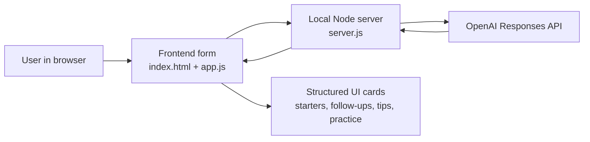

# AI Social Copilot

AI Social Copilot is a hackathon app that helps people navigate everyday workplace conversations with more confidence. It is designed for international students, early-career professionals, interns, and new employees who may find casual workplace communication difficult or intimidating.

## Live Demo Features

- real-time AI-generated workplace conversation guidance
- fallback local demo mode if the API key is not configured
- practice simulation for rehearsing responses
- culturally aware tips tailored to the user scenario
- responsive interface designed for hackathon demos

## Project Title

AI Social Copilot

## Problem Statement

Many talented people struggle with informal workplace communication, especially when they are new to a professional setting, new to a country, or still building confidence in English and workplace culture. Small moments like joining a lunch table, speaking after a meeting, or starting a hallway conversation can feel overwhelming. That friction can lead to isolation, lower confidence, and fewer opportunities to collaborate.

## Solution Overview

AI Social Copilot is an AI-powered conversation assistant for workplace social situations. Users enter a scenario such as a team meeting, lunch break, hallway interaction, or manager check-in. The system then provides:

- conversation starters tailored to the situation
- follow-up responses to keep the exchange going
- suggestions for what to say next
- culturally aware communication tips
- a lightweight practice simulation for rehearsal

The long-term vision is to combine natural language AI, personalization, multilingual support, and voice interaction so users can receive real-time conversational support and practice in a safe, confidence-building environment.

## Hackathon Track

Primary track: AI for Social Impact

Why this track fits:

- The project helps reduce social isolation and communication barriers in professional environments.
- It supports inclusion for international students, immigrants, and early-career talent.
- It uses AI to improve confidence, belonging, and collaboration in a practical day-to-day context.

## Impact

AI Social Copilot has strong long-term potential because the problem is both common and underserved. Social confidence in professional settings affects onboarding, retention, mentorship, and collaboration. This product could grow into a broader workplace communication platform for universities, career centers, internship programs, global companies, and workforce development organizations.

Who it is useful for:

- international students entering internships and full-time jobs
- new graduates and early-career professionals
- employees working in multicultural teams
- organizations that want better inclusion and team belonging

## Feasibility And Scalability

This project is realistic to implement and expand. A first version can use structured prompts and scenario-based generation, while later versions can add:

- live chat and voice conversation coaching
- multilingual support
- adaptive suggestions based on role, company culture, and past interactions
- organization-specific knowledge and onboarding workflows
- analytics for confidence growth and communication patterns

The concept is technically feasible with modern LLM APIs, basic user profile data, and a lightweight web application architecture.

## Codex App Story

This project is a strong fit for a Codex-built workflow because it combines product thinking, UI implementation, prompt design, and submission packaging in one loop. Codex can help with:

- scaffolding the app quickly from a rough idea
- generating and refining UI copy
- implementing the front-end prototype
- drafting README, pitch, and demo materials
- iterating on prompts and interaction flows
- coordinating future parallel workstreams such as UI polish, AI integration, and testing

For a final submission story, describe how Codex helped move from idea to working demo by accelerating design decisions, implementation, and technical writing in one environment.

## Creative Use Of Skills

This project naturally supports practical use of Codex for both coding and non-coding technical work:

- prototyping a responsive product interface
- shaping user journeys and conversation flows
- writing prompt templates for different workplace scenarios
- generating polished project documentation
- preparing pitch materials and demo scripts

## Demo Notes

This repository now contains a working web application with a lightweight Node server and OpenAI-backed generation. The demo experience shows:

- select a workplace scenario
- choose a communication goal and tone
- add personal context
- generate tailored conversation guidance from a live AI model
- review a mini conversation practice flow

## Architecture



More detail is in [docs/ARCHITECTURE.md](/Users/rishithapapolu/Documents/Codex/2026-04-17-i-m-participating-in-a-hackathon/docs/ARCHITECTURE.md).

## Screenshots

Store repo screenshots in [docs/screenshots](/Users/rishithapapolu/Documents/Codex/2026-04-17-i-m-participating-in-a-hackathon/docs/screenshots/README.md). A recommended shot list is included there so you can quickly add polished submission assets.

## Repository Link

Add your GitHub repository link here after pushing:

`https://github.com/rishitha07/ai-social-copilot`

## Additional Resources Or Supporting Materials

You can include:

- a short demo video walking through the app
- screenshots of the interface
- a simple architecture diagram
- prompt examples for conversation generation
- a pitch deck or one-page overview

## Local Run

1. Create a local `.env` file from `.env.example`.
2. Add your OpenAI API key.
3. Start the app:

```bash
npm start
```

4. Open `http://localhost:3000`

If the API key is missing, the app still works in fallback demo mode so you can keep presenting the product.

## Environment Variables

```bash
OPENAI_API_KEY=your_api_key_here
OPENAI_MODEL=gpt-4.1-mini
PORT=3000
```

## OpenAI Integration Notes

The backend uses the OpenAI Responses API with Structured Outputs so the UI receives reliable JSON for:

- conversation starters
- follow-up responses
- what to say next
- cultural tips
- practice dialogue

I chose `gpt-4.1-mini` by default because OpenAI’s current docs describe it as a smaller, faster GPT-4.1 model with strong instruction following and tool-calling support, while the Responses API is the recommended interface for text generation apps and Structured Outputs. Sources: [Responses API guide](https://platform.openai.com/docs/guides/text?api-mode=responses), [Responses API reference](https://platform.openai.com/docs/api-reference/responses/create?api-mode=responses), [Structured Outputs guide](https://platform.openai.com/docs/guides/structured-outputs?lang=javascript), [GPT-4.1 mini model page](https://platform.openai.com/docs/models/gpt-4.1-mini)

## Suggested Next Build Steps

1. Add user authentication and scenario history.
2. Support voice input and spoken response practice.
3. Add multilingual and culturally adaptive guidance.
4. Save favorite suggestions and rehearsal sessions.
5. Create a short demo video that shows a realistic user journey.
