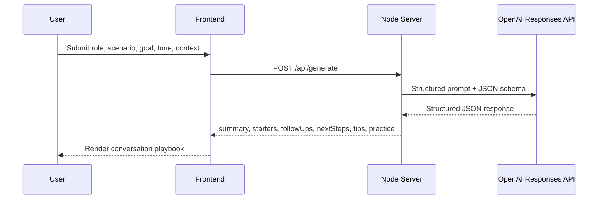

# Architecture

## Overview

AI Social Copilot uses a simple hackathon-friendly architecture:

1. A browser-based frontend collects the user scenario.
2. A lightweight Node server receives the request and keeps the API key private.
3. The server calls the OpenAI Responses API with Structured Outputs.
4. The model returns structured JSON for conversation starters, follow-ups, tips, and practice lines.
5. The frontend renders the response into a polished coaching interface.

## Why This Design Works

- It is fast to build and easy to explain in a demo.
- It avoids exposing the OpenAI API key in client-side code.
- It uses structured JSON rather than brittle freeform parsing.
- It can scale into authentication, conversation history, voice mode, and analytics later.

## Request Flow

## Core Components

- [index.html](/Users/rishithapapolu/Documents/Codex/2026-04-17-i-m-participating-in-a-hackathon/index.html): app structure and UI layout
- [styles.css](/Users/rishithapapolu/Documents/Codex/2026-04-17-i-m-participating-in-a-hackathon/styles.css): visual system and responsive styling
- [app.js](/Users/rishithapapolu/Documents/Codex/2026-04-17-i-m-participating-in-a-hackathon/app.js): frontend interactions, loading states, fallback mode
- [server.js](/Users/rishithapapolu/Documents/Codex/2026-04-17-i-m-participating-in-a-hackathon/server.js): local server, static file serving, OpenAI API integration

## Future Extensions

- conversation memory by user
- voice input and spoken practice mode
- multilingual response coaching
- organization-specific onboarding prompts
- saved sessions and confidence tracking
